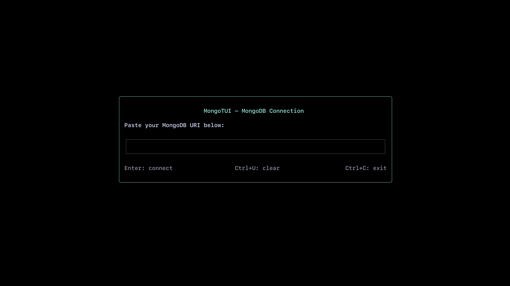
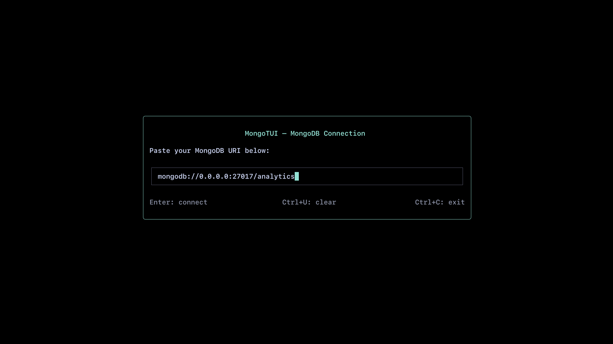
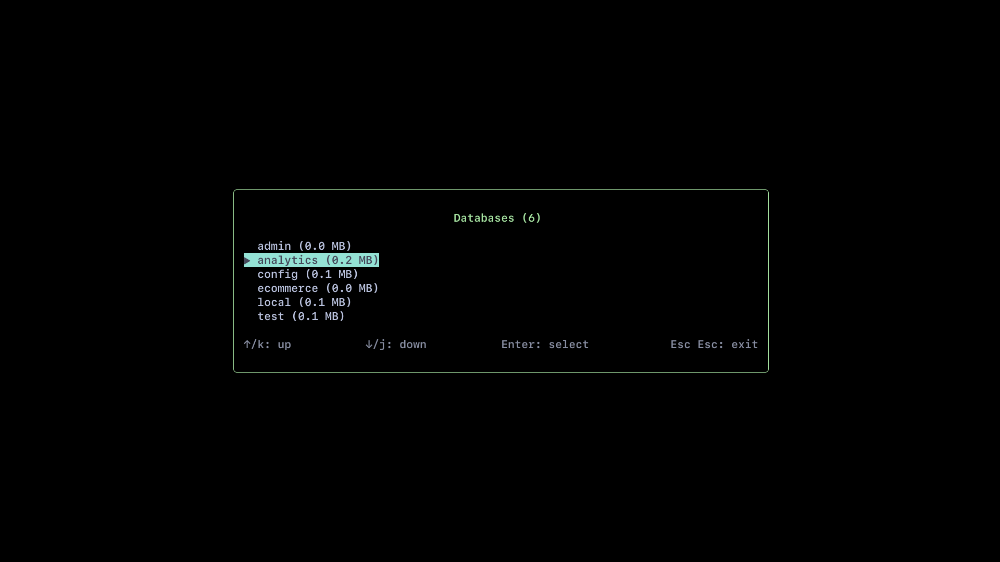
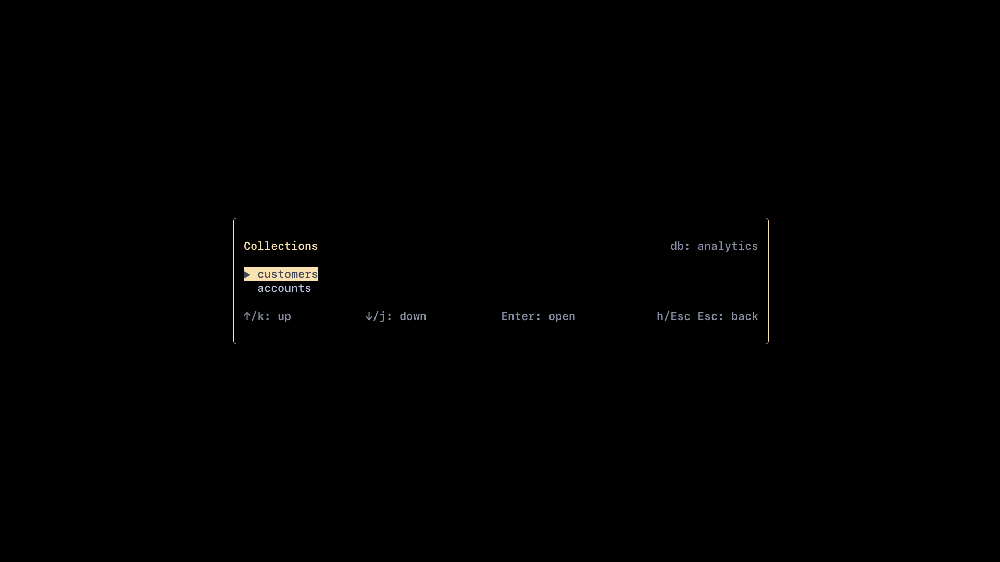
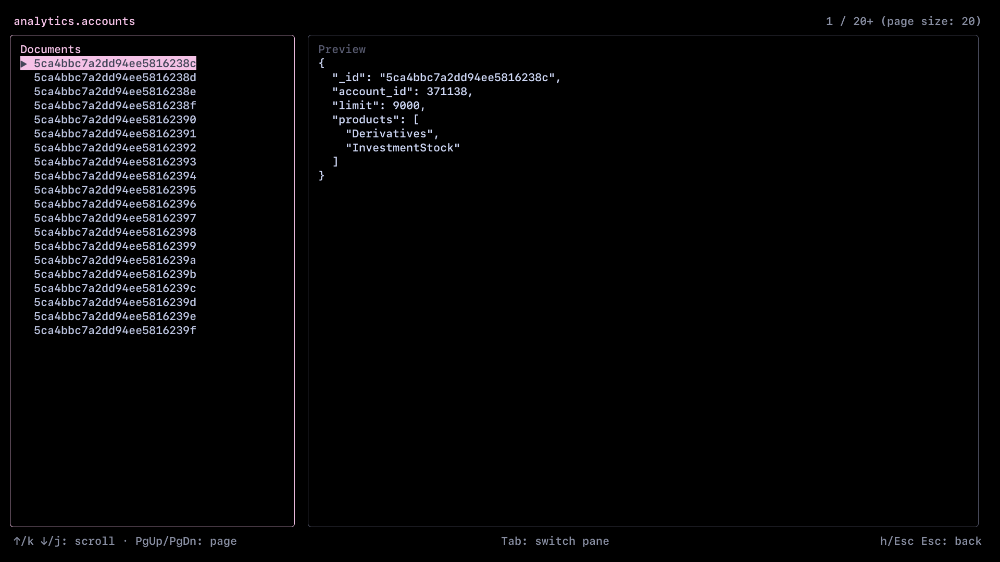
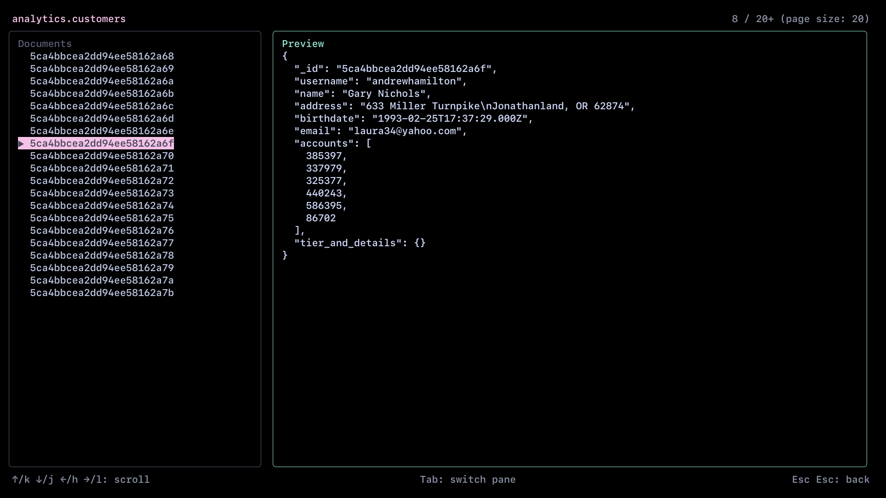

# MongoTUI

Real programmers don't use compass.

*Description*: TUI interface to browse mongdb databases, collections.

*Special Feature*: Automated views and lookups generated as per relations between 
                    documents across same or different collections.

*View*: TUI application with mongodb uri pasting dialog box on startup,
        save uri inside .mongotui file inside global current working directory 

*Technology*: React based tui view, use ink library, use typescript for backend interaction with database.

## Screenshots 

### Login Screen

### URI Input

### Database View

### Collections View

### Paginated Objects View

### Document Preview

## PLAN
NOTE: start with simple views -

  1. on startup paste mongouri in a dialog box.
  2. loading animation (tui compliant)
  3. on error show reason and restart over the initial dialog box view (after 4 seconds)
  4. on success, load a pane with list of all collections
  5. scroll using UP_KEY or 'k' else DOWN_KEY or 'j'
  6. select a collection with enter
  7. loading animation (tui compliant)
  8. on error show reason and move back to list of collections view
  9. on success, show saved documents with allowed movements like 
  scroll using UP_KEY or 'k' else DOWN_KEY or 'j' and PAGE_UP and PAGE_DOWN
  10. press escape key twice to move back to collection view 
  10. press escape key twice to exit program
